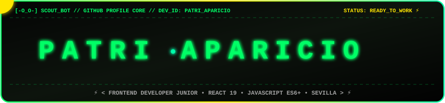
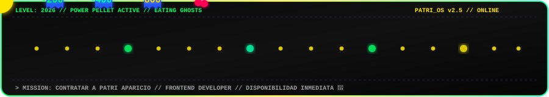

<div align="center">

<!-- 🕹️ Cabecera Dinámica Vectorial: Pac-Man Devorando las Letras Neón de PATRI APARICIO -->


<br><br>

<!-- Badges Cyberpunk de Especialidades -->
<p align="center">
  <a href="https://world-cup2026-sigma-weld.vercel.app/">
    
  </a>
  
  
  
  
  
</p>

<!-- Typing SVG Animado -->
<a href="https://world-cup2026-sigma-weld.vercel.app/">
  
</a>

</div>

---

### `[-O_O-] SCOUT_BOT // 01. QUIÉN SOY & MI HISTORIA`

```yaml
> NOMBRE COMPLETO : Patricia Aparicio Díaz (llámame Patri)
> ROL ACTUAL      : Frontend Developer Junior
> FORMACIÓN       : Inmersa en Bootcamp Intensivo (+600 Horas) hacia Full Stack
> ESPECIALIDADES  : React 19 / 18, JavaScript ES6+, Tailwind CSS, Vitest & RTL, Figma & Stitch
> DISPONIBILIDAD  : Inmediata para incorporarme a equipos Frontend (Remoto o Híbrido en Sevilla)
```

¡Hola! Soy **Patri Aparicio**. Te doy la bienvenida a mi perfil de GitHub. 🎮👾

Durante más de veinte años la música ha sido mi lenguaje para componer, emocionar y conectar con personas. Hoy canalizo esa misma sensibilidad hacia el **Desarrollo Frontend**:
* Una canción nace **nota a nota**; una aplicación web, **línea a línea**.
* En ambos mundos la armonía, la práctica, el ritmo y la atención a cada detalle transforman una idea en una experiencia memorable.

Disfruto creando componentes limpios y modulares en **React**, aplicando maquetación precisa con **Tailwind CSS**, diseñando tokens de UI en **Figma & Stitch** y consumiendo **APIs REST** y modelos de **Inteligencia Artificial (Google Gemini 2.5 Flash)**.

---

### `// 02. MI STACK TECNOLÓGICO & HERRAMIENTAS`

<div align="center">


</div>

<br>

```text
┌───────────────────────────┬───────────────────────────┐
│ 🎨 FRONTEND & UI          │ 📐 DISEÑO UI/UX & TOOLS   │
├───────────────────────────┼───────────────────────────┤
│ • React 19 / 18           │ • Figma (Tokens & UI/UX)  │
│ • JavaScript Moderno ES6+ │ • Stitch (Generative UI)  │
│ • Tailwind CSS            │ • Git & GitHub Flow       │
│ • HTML5 Semántico & CSS3  │ • VS Code & Vercel Deploy │
├───────────────────────────┼───────────────────────────┤
│ 🧪 TESTING & QA           │ ⚙️ BACKEND & IA (EN CURSO)│
├───────────────────────────┼───────────────────────────┤
│ • Vitest (Unit Suites)    │ • Node.js & Express API   │
│ • React Testing Library   │ • PostgreSQL & SQL        │
│ • Component Testing       │ • Google Gemini 2.5 Flash │
│ • Clean Code Standards    │ • RESTful CRUD Endpoints  │
└───────────────────────────┴───────────────────────────┘
```

---

### `// 03. PROYECTOS DESTACADOS`

<table>
  <tr>
    <td width="50%" valign="top">
      <h3 align="center">🏆 WORLD CUP 2026</h3>
      <p align="center">
        Aplicación deportiva completa en tiempo real con estadísticas dinámicas, fixture y filtros.
      </p>
      <p align="center">
        <code>React 19</code> • <code>JavaScript ES6+</code> • <code>REST APIs</code> • <code>React Router</code>
      </p>
      <p align="center">
        <a href="https://world-cup2026-sigma-weld.vercel.app/"><b>🌐 Demo en Vivo</b></a> • 
        <a href="https://github.com/apariciodiazpatricia-cell"><b>🐙 Repositorio</b></a>
      </p>
    </td>
    <td width="50%" valign="top">
      <h3 align="center">🏡 HABITATCODE INMOBILIARIA</h3>
      <p align="center">
        Plataforma inmobiliaria premium diseñada en Figma y trasladada pixel-perfect a React.
      </p>
      <p align="center">
        <code>React</code> • <code>Tailwind CSS</code> • <code>Figma UI/UX</code> • <code>Filtros</code>
      </p>
      <p align="center">
        <a href="https://vercel.com/apariciodiazpatricia-cells-projects"><b>🌐 Demo en Vivo</b></a> • 
        <a href="https://github.com/apariciodiazpatricia-cell"><b>🐙 Repositorio</b></a>
      </p>
    </td>
  </tr>
  <tr>
    <td width="50%" valign="top">
      <h3 align="center">🛡️ VALHALLA DEL CHATARRERO</h3>
      <p align="center">
        E-commerce inmersivo cyber-punk con clima meteorológico en directo y efectos FX.
      </p>
      <p align="center">
        <code>React</code> • <code>OpenWeather API</code> • <code>Audio/Video FX</code> • <code>State</code>
      </p>
      <p align="center">
        <a href="https://vercel.com/apariciodiazpatricia-cells-projects"><b>🌐 Demo en Vivo</b></a> • 
        <a href="https://github.com/apariciodiazpatricia-cell"><b>🐙 Repositorio</b></a>
      </p>
    </td>
    <td width="50%" valign="top">
      <h3 align="center">📻 LA BUHARDILLA RETRO</h3>
      <p align="center">
        E-commerce vintage que consume API propia para CRUD completo de artículos y usuarios.
      </p>
      <p align="center">
        <code>React</code> • <code>API Propia (CRUD)</code> • <code>Meteo API</code> • <code>Tailwind</code>
      </p>
      <p align="center">
        <a href="https://vercel.com/apariciodiazpatricia-cells-projects"><b>🌐 Demo en Vivo</b></a> • 
        <a href="https://github.com/apariciodiazpatricia-cell"><b>🐙 Repositorio</b></a>
      </p>
    </td>
  </tr>
</table>

---

### `// 04. GITHUB ACTIVITY & MATRIX SNAKE`

<div align="center">

<!-- 🐍 Snake Game Devorando el Historial de Contribuciones de GitHub -->
<picture>
  <source media="(prefers-color-scheme: dark)" srcset="https://raw.githubusercontent.com/apariciodiazpatricia-cell/apariciodiazpatricia-cell/output/github-contribution-grid-snake-dark.svg" />
  <source media="(prefers-color-scheme: light)" srcset="https://raw.githubusercontent.com/apariciodiazpatricia-cell/apariciodiazpatricia-cell/output/github-contribution-grid-snake.svg" />
  
</picture>

<br><br>


&nbsp;


</div>

---

### `// 05. PAC-MAN RUNWAY: GAME ON!`

<div align="center">



<br><br>

<!-- Tarjeta Cyberpunk de Contacto -->
<table align="center" style="border: 2px solid #00FF66; border-radius: 16px; background-color: #0d0d0d;">
  <tr>
    <td align="center" style="padding: 24px;">
      <br><br>
      <h3 style="color: #ffffff; margin: 0;"><b>PATRICIA APARICIO DÍAZ</b></h3>
      <p style="color: #00FF66; font-family: monospace; font-size: 14px; margin: 4px 0 16px 0;"><b>⚡ FRONTEND DEVELOPER JUNIOR ⚡</b></p>
      <p style="color: #a0a0a0; font-size: 13px; max-width: 480px;">
        Código limpio, ritmo lógico y pasión por el diseño interactivo. ¡Lista para aportar valor inmediato a tu equipo de desarrollo!
      </p>
      <br>
      <a href="https://linkedin.com/in/patriciaapariciodiaz">
        
      </a>
      &nbsp;
      <a href="mailto:apariciodiazpatricia@gmail.com">
        
      </a>
      &nbsp;
      <a href="https://world-cup2026-sigma-weld.vercel.app/">
        
      </a>
      <br><br>
      <p style="color: #777; font-size: 11px; font-family: monospace;">
        📍 Sevilla, España • 🌍 Remoto / Híbrido • 📞 627 50 52 39
      </p>
    </td>
  </tr>
</table>

<br>

<p align="center" style="font-family: monospace; font-size: 12px; color: #555;">
  Diseñado con 💚 por <b>Patri Aparicio</b> © 2026 • <code>Ready Player One</code>
</p>

</div>
